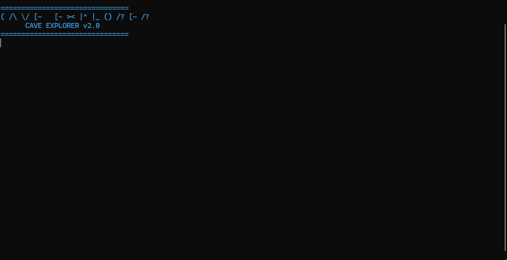
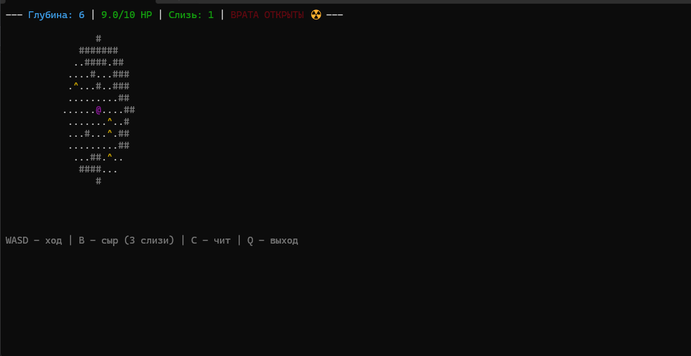
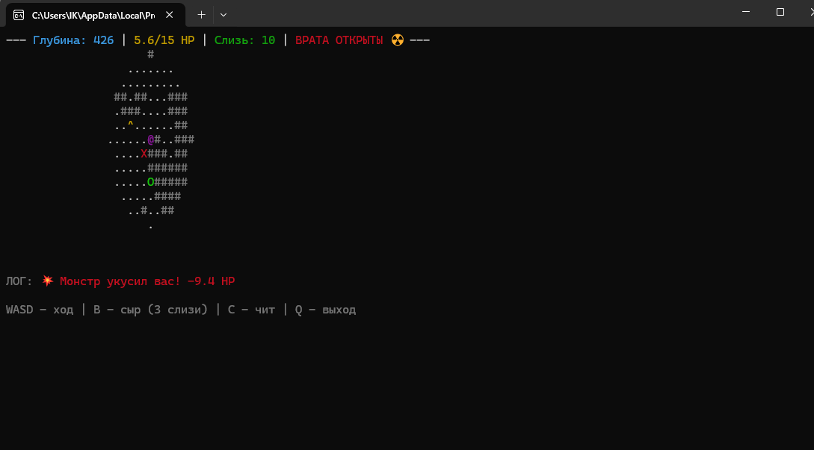

# 🕳️ Simple Cave Explorer v2.0

Ⓒⓐⓥⓔ Ⓔⓧⓟⓛⓞⓡⓔⓡ

Хардкорный консольный рогалик (Roguelike) на Python с ANSI-графикой, системой крафта еды и чит-кодами. Исследуй бесконечные пещеры, собирай слизь и выживай в нестабильных зонах!

## 📸 Скриншоты



*(Здесь будут отображаться твои скриншоты прямо на странице)*

## ✨ Особенности
- **Динамическая генерация:** Каждый уровень создается случайным образом.
- **Кроссплатформенность:** Можно играть на Windows и Mac.
- **ANSI-магия:** Полностью цветной интерфейс без использования тяжелых графических библиотек.
- **Система выживания:** Собирай слизь (slime), чтобы готовить лечебный сыр.
- **События:** Нестабильные зоны с таймером обвала.
- **Система сидов:** С помощью сидов можно показать хорошую пещеру кому-нибудь.

## 🕹️ Управление
- **W, A, S, D** — Перемещене персонажа (@)
- **B** — Съесть сыр (требуется 3 ед. слизи, восстанавливает 2 HP)
- **C** — Открыть консоль для ввода чит-кодов (Введите list для списка читов)
- **Q** — Выход из игры

## 🛠️ Как запустить
1. Убедитесь, что у вас установлен **Python 3.x**.
2. Скачайте файл `cave.py` в одну папку.
3. Запустите игру:
   ```bash
   python cave.py
